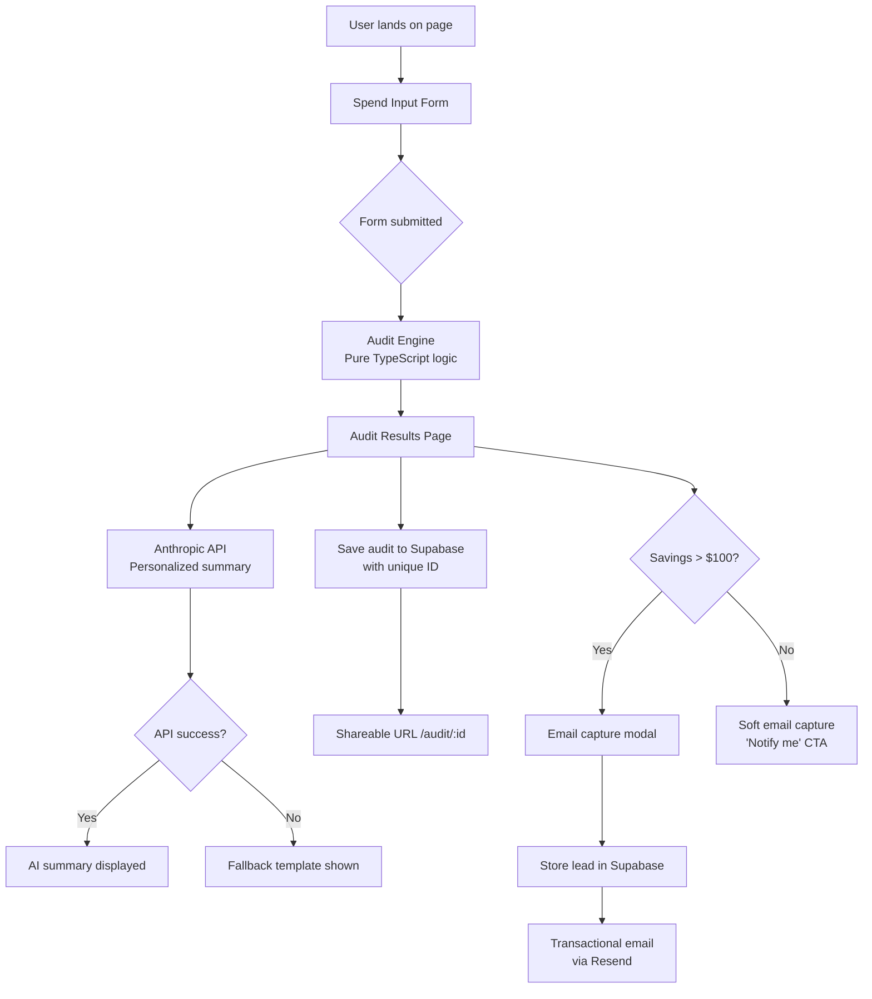

# Architecture

## System Diagram

## Data Flow

1. User fills spend form → stored in localStorage (persists on reload)
2. On submit → POST /api/audit with FormInput JSON
3. API route runs auditEngine.ts (no AI, pure rules)
4. Simultaneously calls Anthropic API for summary paragraph
5. Saves full audit object to Supabase `audits` table with nanoid
6. Returns audit ID → client redirects to /audit/[id]
7. Results page fetches audit by ID from Supabase
8. User optionally submits email → POST /api/lead → stored in `leads` table

## Tech Stack

- **Next.js 14 (App Router)**
- **TypeScript**
- **Supabase**
- **Tailwind + shadcn/ui**
- **Resend**
- **Vercel**
