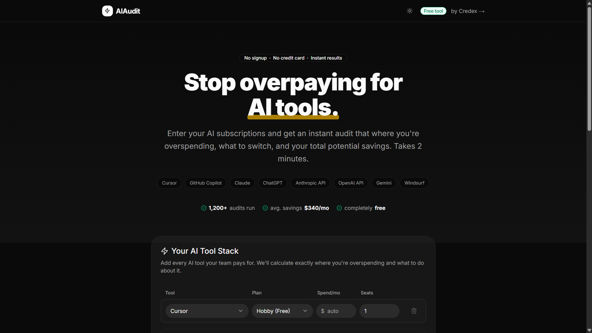
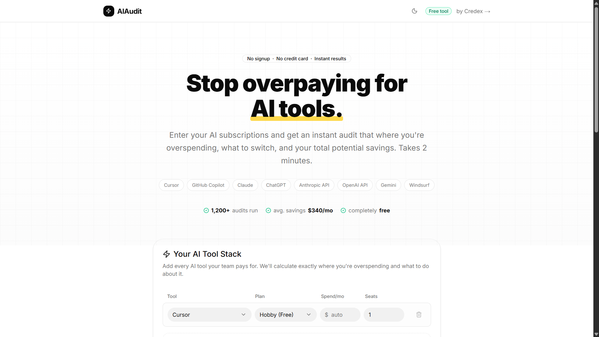
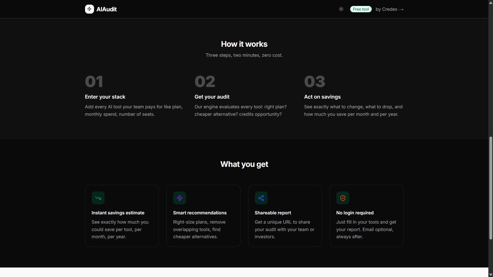
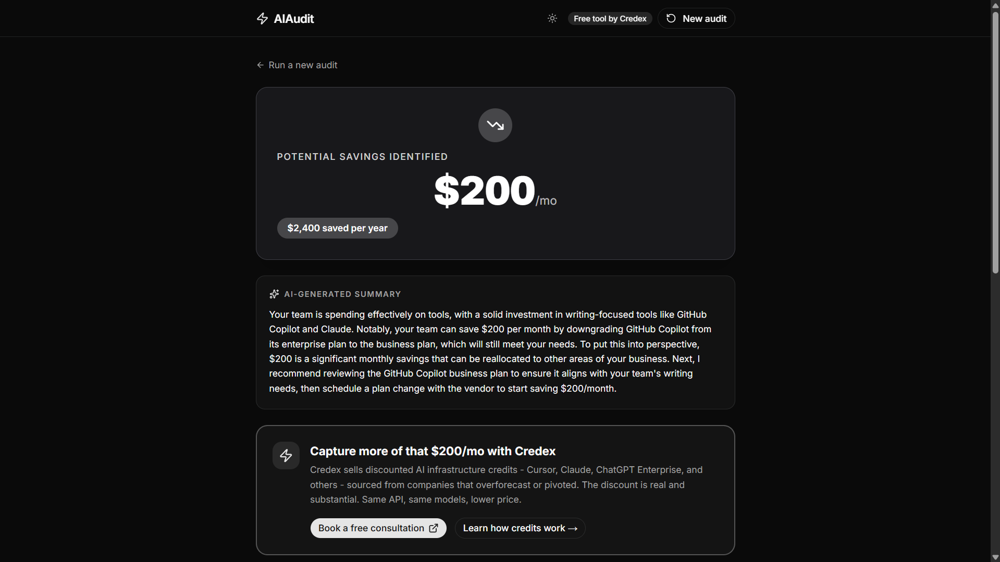
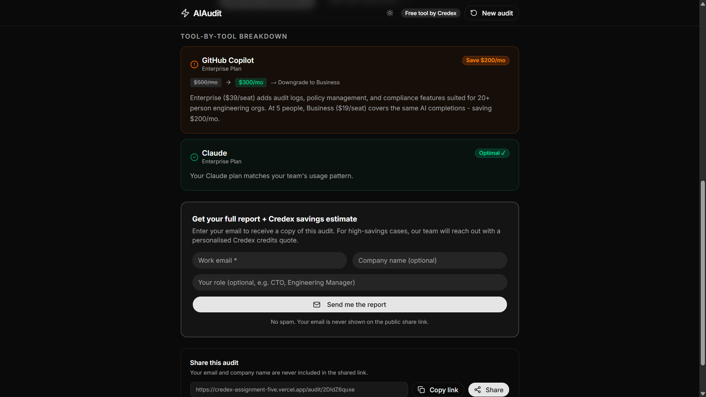
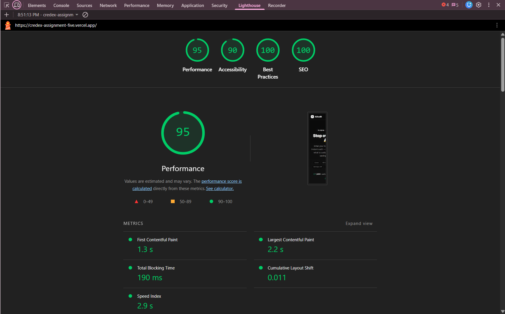

# AIAudit

AIAudit is a small SaaS-style tool that helps teams identify unnecessary AI subscription costs across tools like ChatGPT, Claude, Cursor, Copilot, Gemini, and Windsurf.

The app analyzes a user's current AI stack and generates recommendations for:
- overlapping tools
- unnecessary seats
- incorrect plans
- potential monthly and yearly savings

Built for the Credex AI Spend Optimizer assignment.

---

## Live Demo

https://credex-assignment-five.vercel.app

---

## Tech Stack

- Next.js 14 (App Router)
- TypeScript
- Tailwind CSS + shadcn/ui
- Supabase
- OpenAI API
- Resend
- Vitest
- Vercel

---

## Features

- Multi-tool spend input form
- Deterministic audit engine
- AI-generated audit summary
- Shareable audit URLs
- Lead capture flow
- localStorage persistence
- Unit-tested recommendation logic

---

## Local Setup

Install dependencies:

```bash
npm install

Create a .env.local file in the root directory:

```bash
OPENAI_API_KEY=
SUPABASE_URL=
SUPABASE_ANON_KEY=
SUPABASE_SERVICE_ROLE_KEY=
RESEND_API_KEY=
NEXT_PUBLIC_APP_URL=http://localhost:3000

Run the development server:

```bash
npm run dev

Open the app:

```bash
http://localhost:3000

Running tests:

```bash
npm run test

---

## Screenshots











---

## Lighthouse

